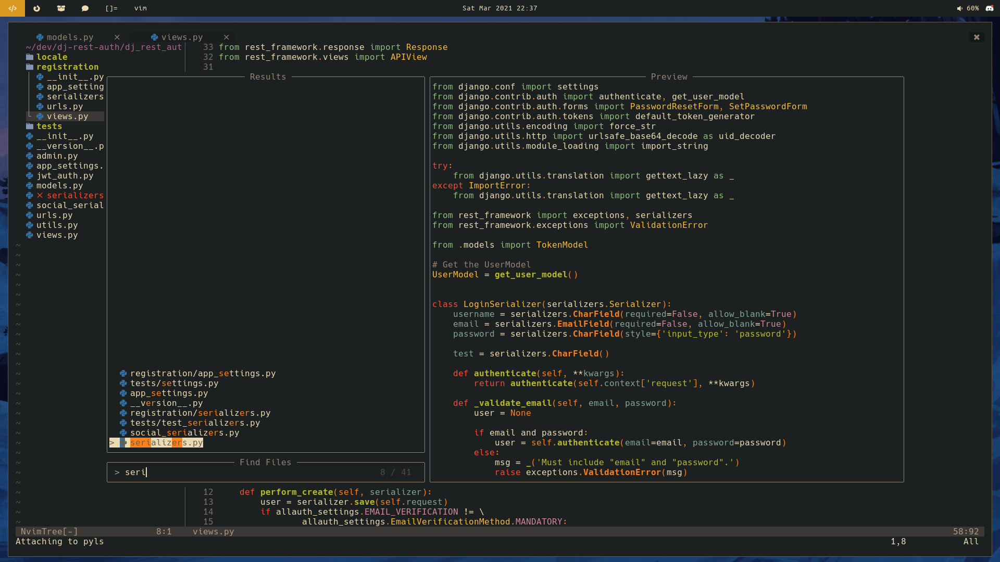

# My personal dotfiles

## Dependencies

### Neovim

#### :camera_flash: Example Screenshots




Nerd font

```
yay -S nerd-fonts-hack
```

Neovim version 5.0+

```
yay -S neovim-nightly-bin
```

Plugin manager: [packer.nvim](https://github.com/wbthomason/packer.nvim)

```
git clone https://github.com/wbthomason/packer.nvim\
 ~/.local/share/nvim/site/pack/packer/opt/packer.nvim
```

#### Optional

If you want to use :LspInstall for installing language servers you will need npm.

```
pacman -S npm
```

To install `npm` packages globally without sudo follow [this](https://github.com/sindresorhus/guides/blob/main/npm-global-without-sudo.md) guide

## Quick Neovim setup guide

### Installation

Copy the `.config/nvim` folder to your nvim config location.

```sh
cp -r .config/nvim ~/.config
```

#### Plugins

Navigate to the `.config/nvim/lua/config` folder.

```sh
cd ~/.config/lua/config
```

Open `init.lua` and comment out the all the `require` statements except for `require'plugins.lua'`.

Save and exit.

Open vim and type `:PackerCompile` & `:PackerInstall`.

You should now have installed all the plugins specified in plugins.lua.

Last step go back in `init.lua` and uncomment the `require` statements.
